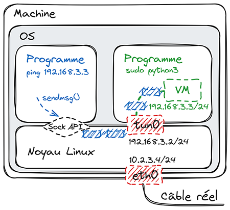

# A machine that responds to ping

1. Setup Python environment / install scapy which helps to interpret and generate network packets:
```shell
mkdir tuntest; cd tunetest
python3 -m venv .venv
.venv/bin/pip install scapy
```
2. Run Python interpreter with sudo since we need special privileges to create TUN interface:
```shell
sudo .venv/bin/python3
```
3. Define low level constants with values retrieved with `grep -Hnry /usr/include`: 
```python
TUNSETIFF = 0x400454ca
IFF_TUN = 0x0001
IFF_TUN = 0x0001
IFF_NO_PI = 0x1000
```
4. Open special file `/dev/net/tun` used for creating a virtual network interface:
```python
tun_fd = open("/dev/net/tun", "r+b", buffering=0)
```
5. `/dev/net/tun` allows to create either a TUN interface (IP packets layer) or a TAP interface (IP packets layer + Ethernet layer). We configure TUN mode through a system call handled by `ioctl` (perform the operation \`request\` on file descriptor \`fd\`):
```python
import struct, fcntl
ifr = bytearray(struct.pack('16sH', b'', IFF_TUN | IFF_NO_PI))
fcntl.ioctl(tun_fd, TUNSETIFF, ifr)
```
- Note: In C, this part would be more explicit. In fact, the last argument of ioctl() is supposed to be an ifreq struct. Here, to force Python to manage memory in this format, we're doing a bit of tweaking. But let's move on. We've therefore chosen IFF_TUN rather than IFF_TAP, and with IFF_NO_PI we disable an unnecessary header1 in front of each packet.
6. Check the new created interface in an other terminal:
```shell
ip link | grep tun
38: tun0: <POINTOPOINT,MULTICAST,NOARP> mtu 1500 qdisc noop state DOWN mode DEFAULT group default qlen 500
```
7. Give the interface an IP address and turn it on:
```shell
sudo ip addr add 192.168.3.2/24 dev tun0
sudo ip link set up dev tun0
sudo ip a
```
8. Figure 1

9. Let run a `ping` session in a second terminal:
```shell
ping 192.168.3.3
```
10. In the Python interpreter we should receive the "echo request" generated by `ping`:
```python
import os
packet_bytes = os.read(tun_fd.fileno(), 4096)
len(packet_bytes)
```
- We received a first packet. Since we do TUN and not TAP we receive IP packets: the first bytes are those of the layer IPv4, then those of the ICMP layer. For other protocols, we could have more network layers, for example IPv4 + TCP + HTTP (or IPv6 + TCP + HTTP).
11. Let's decode with Scapy:
```python
IPv4(packet_bytes)
```
12. Nope, obviously it is an IPv6 packet:
```python
from scapy.layers.inet6 import IPv6
IPv6(packet_bytes)
<IPv6  version=6 tc=0 fl=0 plen=8 nh=ICMPv6 hlim=255 src=fe80::7e8e:331c:ea7f:1c76 dst=ff02::2 |<ICMPv6ND_RS  type=Router Solicitation code=0 cksum=0xc496 res=0 |>>
```
- This is a packet issued by the autoconfiguration mechanism IPv6. It is clear that as soon as a new interface appears, the OS immediately sends a few packets to try to obtain an IP, via DHCP or via this IPv6 autoconfiguration mechanism, or to detect duplicate IPv6 addresses, etc. Our TUN interface is no exception.
13. Implement a loop to handle and pass this initial traffic:
```python
while True:
    packet_bytes = os.read(tun_fd.fileno(), 4096)
    IPv4(packet_bytes)
```
- Our echo-request packets arrive every second
14. We sent back a response for every packet. We need to find the "echo-reply" integer (0):
```python
from scapy.layers.inet import ICMP
type_echo_reply = ICMP.type.s2i["echo-reply"]
while True:
    packet_bytes = os.read(tun_fd.fileno(), 4096)
    packet = IPv4(packet_bytes)
    if "ICMP" not in packet:
        continue
    resp_packet = packet.copy()
    resp_packet[IPv4].src = packet[IPv4].dst
    resp_packet[IPv4].dst = packet[IPv4].src
    resp_packet[ICMP].type = type_echo_reply
    del resp_packet[IPv4].chksum
    del resp_packet[ICMP].chksum
    resp_bytes = bytes(resp_packet)
    os.write(tun_fd.fileno(), resp_bytes)
```
- Our echo-reply looks like a lot to the echo-request packet except we have to change its type, revert its source IP and destination IP, et recompute the checksums. For the packet filtering we just check if they are ICMP packets. The only subtlety is the method to force Scapy to recalculate checksums: we delete the corresponding attribute of the packet.
